

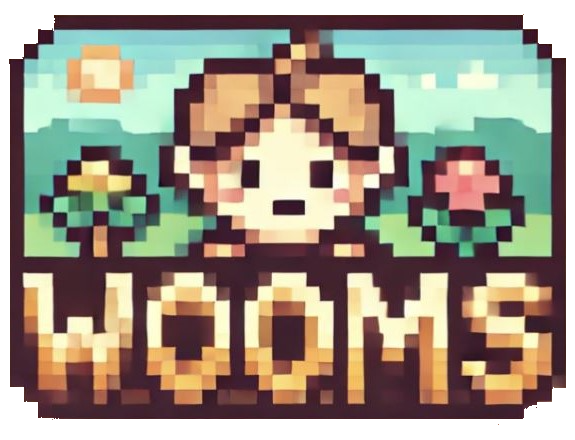

## 우리들의 추억 저장소, WOOMS

개방적인 SNS에 피로감을 느끼는 사람들을 위한 메타버스, WOOMS   소수의 인원이
그룹을 구성해 방명록, 사연 남기기, 픽셀 변환 사진 저장, 편지 주고 받기 등 다양한
방식으로 추억을 저장하고 소통할 수 있는 공간입니다 😊  

> 개발 기간: 2024.07.08 ~ 2024.08.16

## 목차

### - [주요 기능](#주요-기능)

### - [서비스 화면](#서비스-화면)

### - [기술 스택](#기술-스택)

### - [팀원 구성](#팀원-구성)

### - [회고](#회고)

  

## 주요 기능

### 편지 작성

- 내가 가입한 그룹 내에 있는 사람들에게 편지를 작성할 수 있습니다.
- 편지 도착 예정일을 지정할 수 있습니다.(하루 뒤, 사흘 뒤, 일주일 뒤)

### 편지함

- 읽은 편지와 안 읽은 편지를 구분해, 안 읽은 편지를 먼저 띄웁니다.
- 편지가 오는 중인지 아닌지 알 수 있습니다.

### 사진관

- 그룹 내 사람들끼리 공유하는 사진관입니다.
- 사진을 픽셀 변환해 업로드 할 수 있습니다.
- 픽셀 변환의 정도와 색상 팔레트를 선택할 수 있습니다.
- 사진을 더이상 보여주기 싫다면 사진을 뒤집어놓을 수 있습니다.

### 사진 지도(채움)

- 업로드 한 사진의 메타데이터로 지도의 어느 위치에 해당하는지 확인해, 지도에
  있는 픽셀의 색을 채웁니다.
- 그룹 별로 방장이 색을 지정할 수 있으며, 같은 위치에 업로드 된 사진이 많을수록
  색이 진해집니다.

### 방명록

- 그룹 내 사람들끼리 공유하는 방명록입니다.
- 하루에 한 번 작성할 수 있습니다.

### 라디오

- 그룹 내 인원들끼리 공유합니다.
- 사연을 작성하면, AI가 실제 라디오 DJ처럼 스크립트를 작성해 읽어줍니다. (TTS)

  

## 서비스 화면

### 메인 페이지

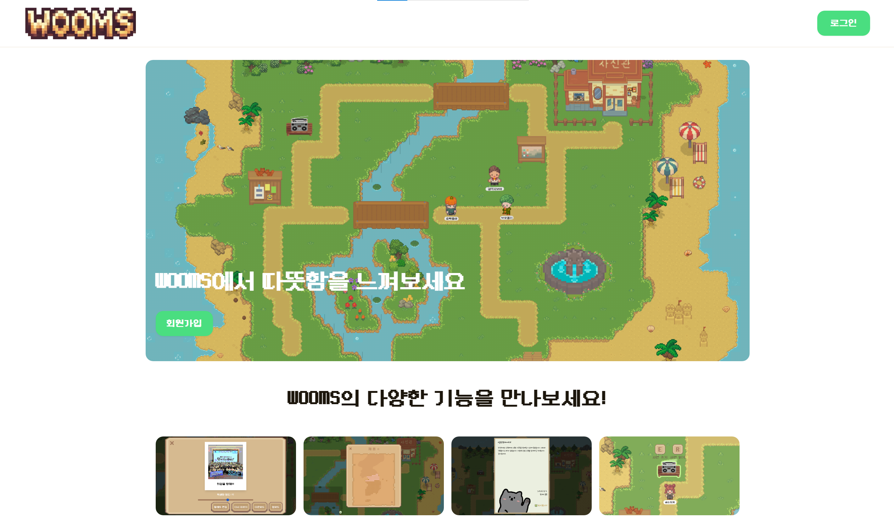

|                     로그인                     |                   회원가입                    |
| :--------------------------------------------: | :-------------------------------------------: |
| 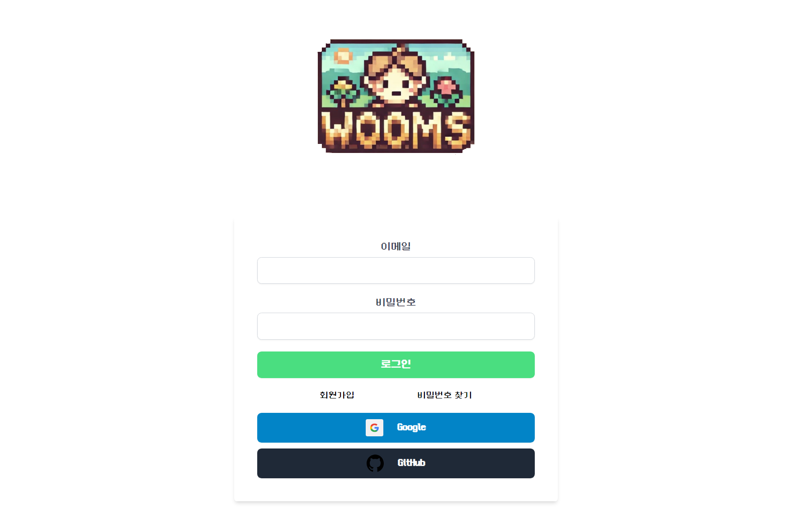 | 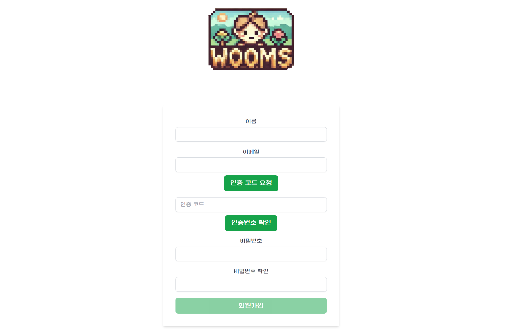 |

### 개인 공간 페이지

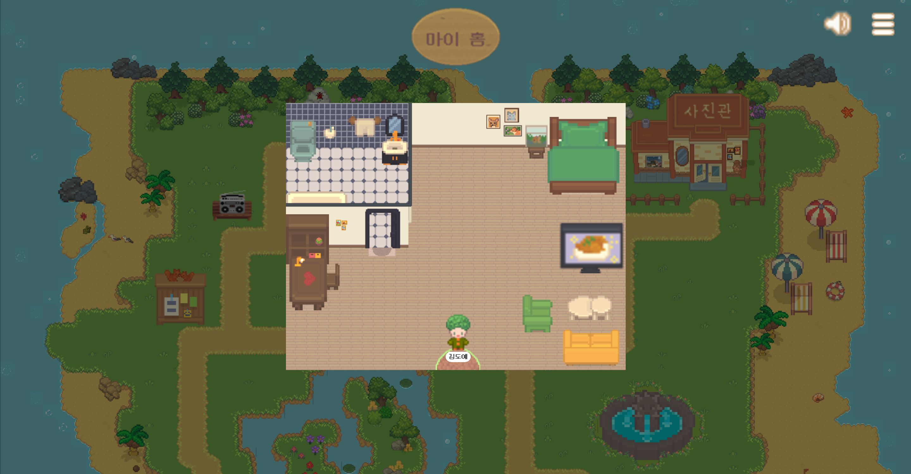

|                       편지 작성                        |                        편지함                         |                       편지 읽기                        |
| :----------------------------------------------------: | :---------------------------------------------------: | :----------------------------------------------------: |
| 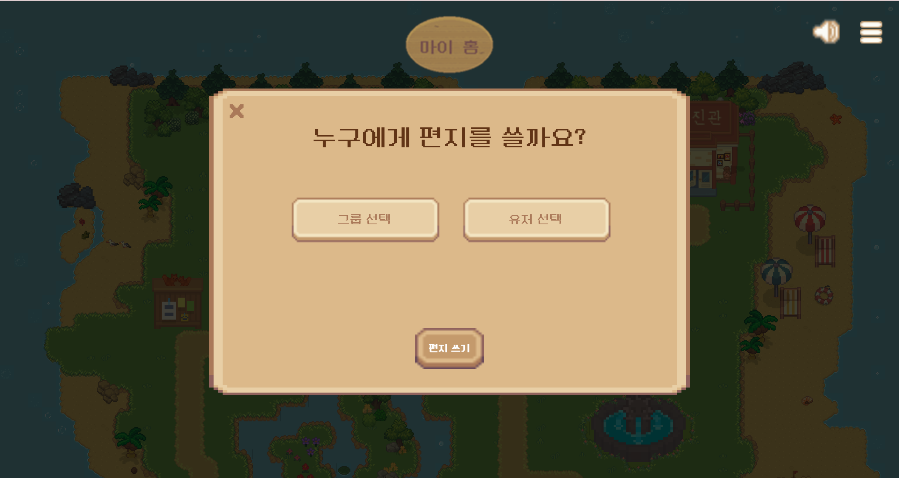 | 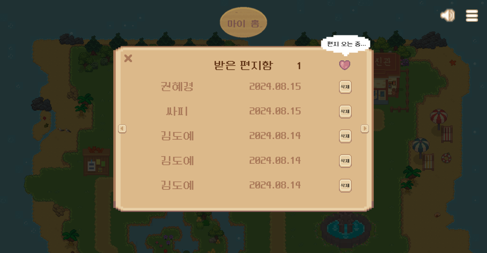 | 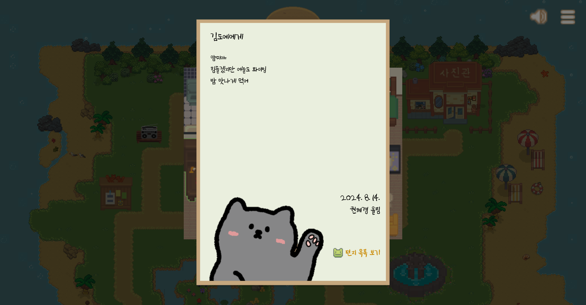 |

### 그룹 공간 페이지

|                  사진 픽셀 변환                   |                      사진 지도                       |
| :-----------------------------------------------: | :--------------------------------------------------: |
| 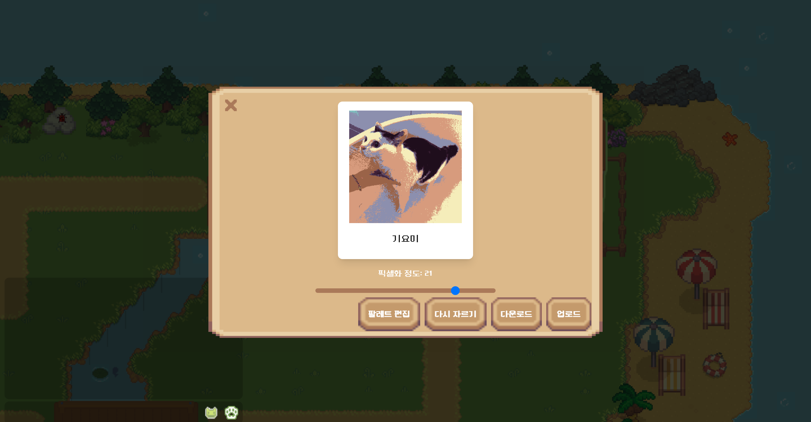 | 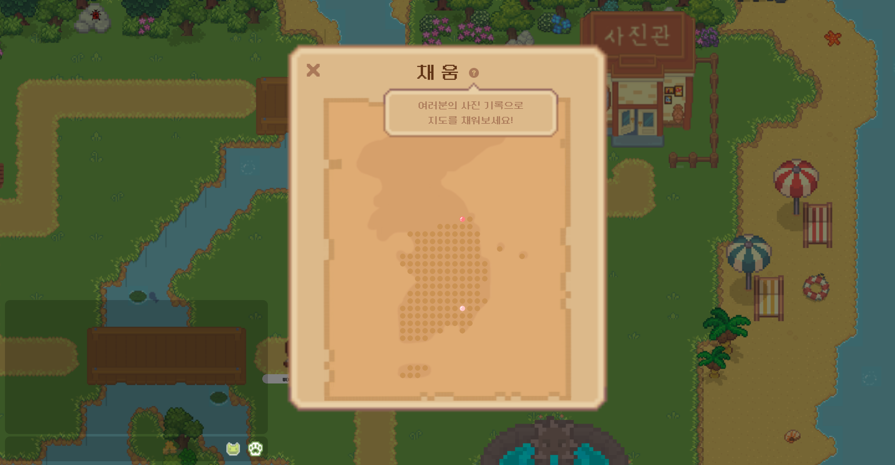 |

|                       방명록                       |                      라디오                       |
| :------------------------------------------------: | :-----------------------------------------------: |
| 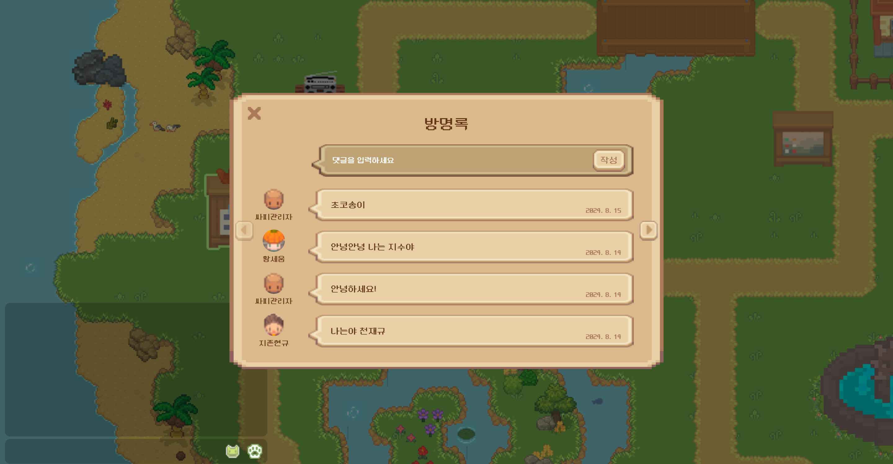 |  |

## 기술 스택

### FRONTEND

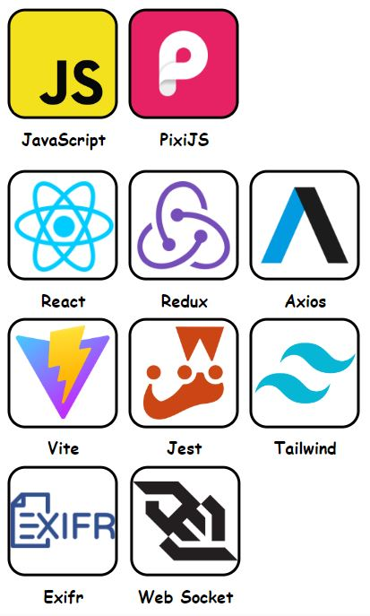

---

### BACKEND

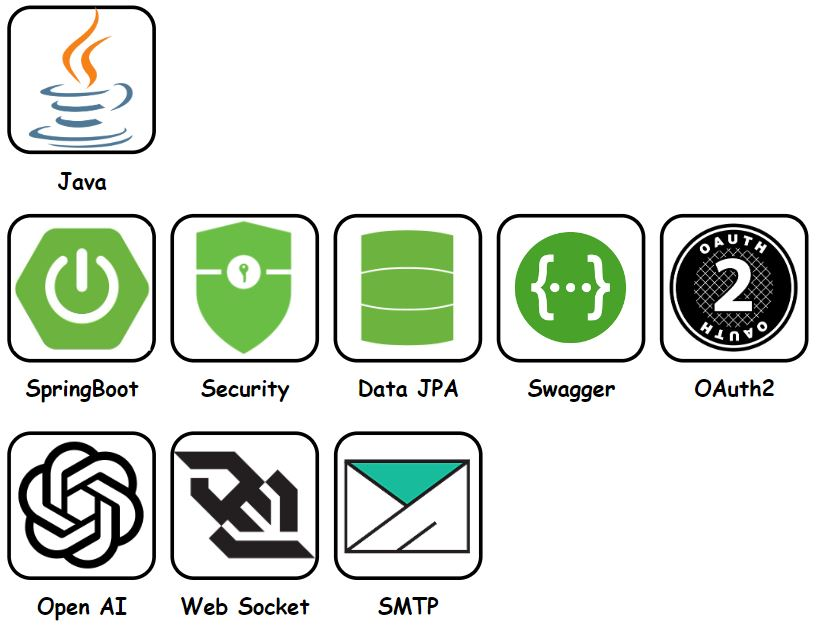

---

### INFRA

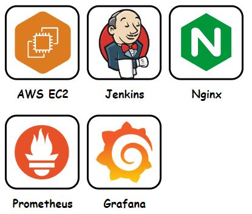

---

### DATA

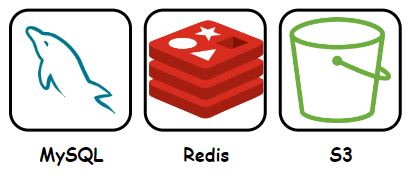

---

### TOOLS

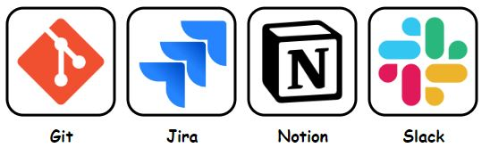

## 팀원 구성

| 송도언(팀장) | 김도예 | 윤대영 | 이현수 | 정 훈 |  홍성우   |
| :----------: | :----: | :----: | :----: | :---: | :-------: |
|      BE      |   FE   |   FE   |   BE   |  FE   | Infra, BE |

## 회고
